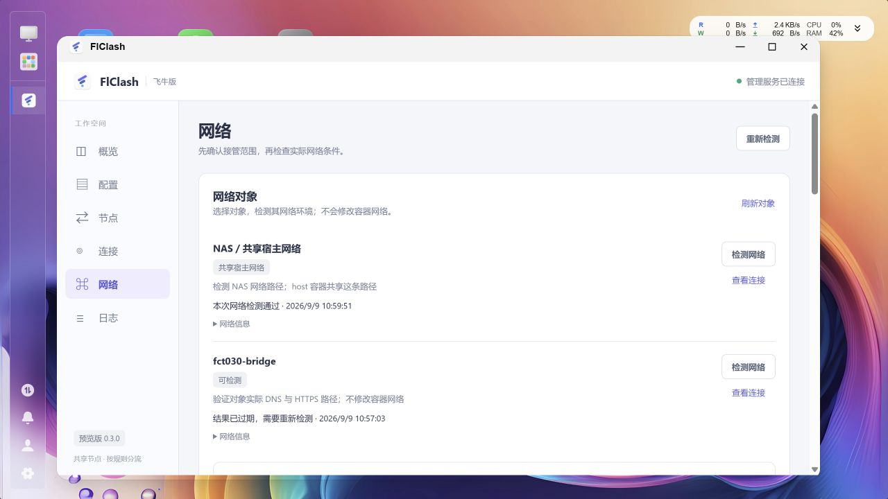
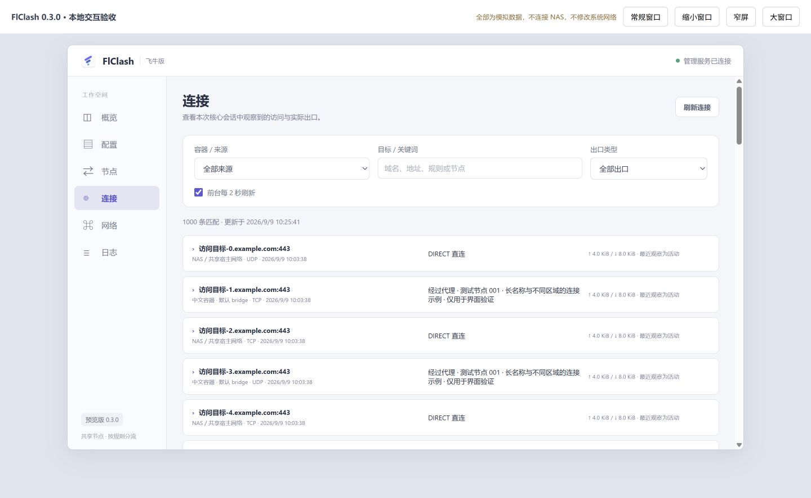
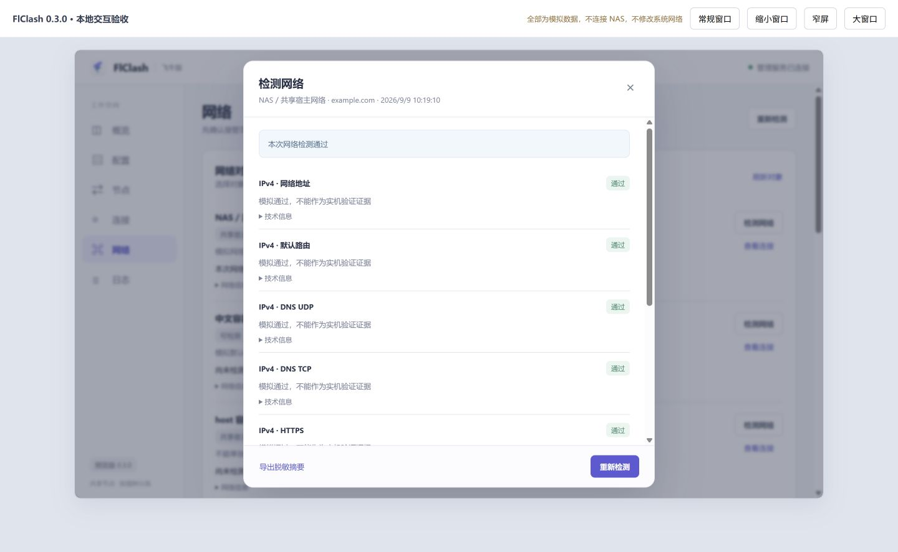
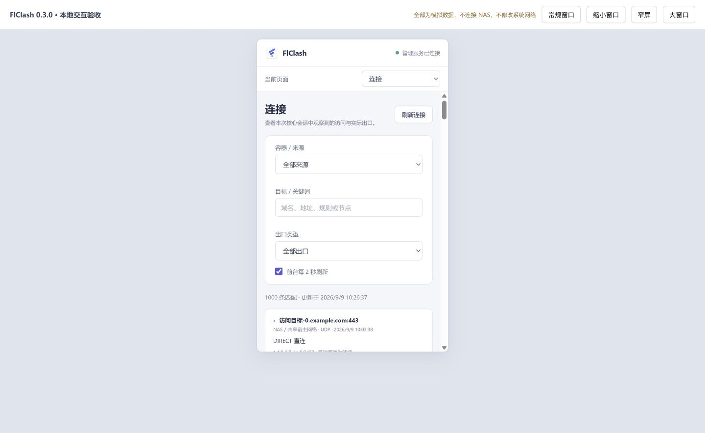

# FlClash 飞牛 0.3.0 测试记录

## 验证环境与边界

- 开发机：Windows，Go 1.26.4，Node.js 24；Linux AMD64 v1 交叉构建。
- 计划最低版本保持 fnOS 1.2.0505；本轮测试 NAS 已升级为 **fnOS 1.2.0602 / x86_64**。不能用较新版本实测替代 1.2.0505 验收。
- 已生成 0.3.0 FPK 并执行实机回归；功能交付与完整网络兼容性验收分开记录。当前环境存在间歇性 TLS 握手超时，不能宣称全部目标始终可达。
- 真实订阅只在已授权 NAS 使用；测试文件、截图和摘要不保存订阅凭据或 YAML。

## 开发机回归

- 后台 `go test ./...` 与 `go vet ./...` 通过。
- 前端 21 项自动化测试通过，覆盖 500 节点、1,000 条连接分页、中文筛选、轮询保持焦点与展开项、旧请求丢弃、检测取消及历史过期。
- DNS UDP / TCP 使用独立报文验证，不走系统 hosts 快捷解析；包含双协议回环服务测试。
- 后台覆盖完整连接元组关联、连接缓存边界、旧核心会话隔离、HTTP 401、TLS 校验失败、仅 IPv4、取消与停用回收、目标发现并发、脱敏导出。
- Linux AMD64 测试二进制在 NAS 普通用户权限下通过，包含固定真实核心协议及回退测试，未运行 race 检查。真实核心协议测试使用独立临时数据目录，不连接真实订阅、不启用 TUN。

## 发现并修复的问题

| 问题 | 修复与回归 |
| --- | --- |
| 输出大小限制可被标准库快捷读取路径绕过 | 限额缓冲区不暴露嵌入 Buffer，测试读取上限 |
| 成功结束后的取消清理可能将结果误报为取消 | 先记录上下文结果，再清理资源 |
| 发现对象期间再次检测可能获得空列表 | 等待同次发现任务，短锁读取共享结果 |
| 检测开始后取消按钮仍处于禁用状态 | 结束提交阶段恢复取消操作，增加浏览器交互回归 |
| 导出时未指定记录可能引起类型断言失败 | 缺少或过期的 ID 返回稳定错误，补充回归 |
| 操作开始后旧检测仍在继续 | 互斥操作开始即取消上下文，历史结果标为过期 |
| 检测失败只有笼统提示 | 提供脱敏技术原因；失败项目生成可读警告事件，与代理路径分开展示 |
| 对象状态提示与最近结果重复或冲突 | 能力说明与检测结果分开，首次列表优先 NAS 和运行中的可检测对象 |
| 本机回环测速测试偶发得到 -1 | 固定核心把小于 1ms 的结果视为无有效延迟；回环测试服务增加 10ms 响应时间，避免零毫秒导致协议测试假失败，不修改用户节点或核心行为 |

## 实机结果

测试使用标记为 `flclash.acceptance=0.3.0` 的隔离 BusyBox 容器，未改业务容器网络。真实订阅仅留在 NAS。完整记录只保留测试对象名称、检查分类、HTTP 状态、规则类型及是否有关联证据，不包含真实节点名、订阅、目标访问历史。

| 项目 | 结果与边界 |
| --- | --- |
| 0.2.1 → 0.3.0 手动安装升级 | 应用中心安装、桌面图标及内嵌入口正常，2 份配置、订阅与设置保留 |
| 同版本后续构建 | 飞牛命令行只提示已安装；界面明确拒绝相同或更低版本。后续修补通过应用中心停用/启动并替换本次编译程序验证，保留旧程序备份；运行程序校验值与交付包一致。未伪造版本号、未卸载清空数据 |
| NAS、默认 bridge、自定义 bridge、host、共享网络 | 均实际运行独立检测进程；取得过 DNS UDP、DNS TCP、HTTPS 204 成功和代理连接证据，但部分轮次出现超时，不能认定持续稳定性全通过 |
| Docker 仓库 | NAS 目标实际返回 HTTP 401，判定服务可达、业务仍需认证；捕获代理路径。测试镜像实际拉取成功 |
| DIRECT | 默认 bridge 在全部直连模式下 HTTPS 204、路径 DIRECT、关联证据通过，随后恢复原规则模式 |
| 三轮主流程 | 多次完整执行三轮，代理启停与最终设置恢复均通过。最终构建的基线 NAS 和四类容器均 DNS UDP/TCP、HTTPS 204、代理证据通过；随后的三轮 NAS 均出现 HTTPS 超时，默认 bridge 第一、三轮通过，第二轮 DNS TCP/HTTPS 失败且路径未确认。前一构建第二、三轮曾全部通过。没有把执行三轮等同于三轮无故障 |
| host / 共享网络归属 | host 归 NAS；共享命名空间的容器归同组，不根据 IP 指认组内应用 |
| 停止 / none | 分别返回 stopped / isolated，不执行探测，不回退到宿主机冒充结果 |
| 多网络 | 临时为本轮 bridge 测试容器接入额外测试网络，归属标为不确定；断开附加网络后恢复，未改变原网络 |
| 容器互访 | 两个测试容器经同一自定义 bridge 建立 TCP/HTTP，空测试目录返回 404，证明服务可达，不代表业务内容测试 |
| 发布端口 | NAS 访问测试容器发布端口得到 HTTP 404，转发路径可达 |
| 容器重启 | 检测期间重启对象，旧结果 stale=true / context_changed；未将旧网络环境结果当成当前结果 |
| 取消及配置变化 | 取消后 cancelled；模式变化后 context_changed；检测完成后未遗留 probe 进程 |
| NAS 管理与 SMB | 浏览器管理入口正常；SMB 只验证 TCP 445 可达，未做共享目录认证及文件读写 |
| 权限和脱敏 | 管理员鉴权、普通用户拒绝、CSRF 和导出白名单通过自动化回归；没有创建新的 NAS 普通用户或修改账户权限 |

可复现证据：[最终构建三轮与路径检测](docs/acceptance/0.3.0/flclash-acceptance-030-delivery.jsonl)、[前一轮对照](docs/acceptance/0.3.0/flclash-acceptance-030-latest.jsonl)、[容器状态与局域网检查](docs/acceptance/0.3.0/flclash-network-030.jsonl)。执行脚本位于 `tests/nas-acceptance.py` 和 `tests/nas-network-check.py`，必须显式传入 `--run-authorized-test`，只用于已授权测试环境。

最终运行监督程序 SHA256：`a2040521f91e5257b6f51145cb6471abca5f626ab0101fe0f4795e2300394522`；通过 `/proc/<监督进程>/exe` 再次核对，确认不是仅替换磁盘文件。

### 未解决的网络现象

- 真实请求存在 `TLS handshake timeout` 和请求时限到期；早期轮次还出现 DNS TCP 超时。部分失败请求仍有关联代理连接，部分早期请求路径未确认，界面分别给出结论。
- 保留 60 秒任务上限、8 秒单项上限、证书验证与当前规则，没有为了测试变绿而忽略错误、切换节点或延长为无限等待。
- 尚不能确定超时在本地上游网络、节点还是目标服务，需要独立对照环境才能进一步归因；不是“所有网络均已支持”的证明。

## 浏览器交互与截图

- 实际飞牛窗口检查六页；顶部 56px、侧栏 176px，正文滚动至末尾后顶栏 y=0、侧栏 y=56，外层页面不滚动。
- 模拟配置覆盖 500 节点、1,000 连接及长名称；检查 390px 顶部页面选择器、策略组搜索、配置弹窗和连接卡片；模拟截图明确标记为模拟数据，不作为真实流量证据。
- 普通窗口、飞牛最大化、390px 模拟内嵌窗口与弹窗已检查；浏览器缩放及全部尺寸组合未形成完整验收矩阵，不宣称全部通过。

## 尚未验收

- fnOS 1.2.0505、完整 IPv6 双栈、虚拟机路径：当前无对应环境。
- 自定义 DNS 上游的独立容器对照、完整 UDP 应用协议、SMB 文件读写、容器业务自身证书/代理环境变量：未验收。
- NAS 整机重启与断电、真实节点全断后的恢复、缺失 nsenter 系统条件注入：本轮未进行，未把普通启停当作这些场景通过。
- 浏览器全部缩放与缩小尺寸组合；0.3.0 卸载重装：未做完整复验。
- 开发机缺少 C 编译器，Windows `go test -race` 暂不可执行。

## 测试环境收尾

- 恢复原规则模式、仅 IPv4 和开启状态，2 份配置及原节点选择保留。
- 本轮创建的 `fct030-*` 隔离测试容器已停止，容器、测试网络与镜像保留供复验；未删除既有测试数据，未留下临时发布端口服务。
- 临时 SSH 恢复通道在收尾时关闭；未更改账户密码或权限。
